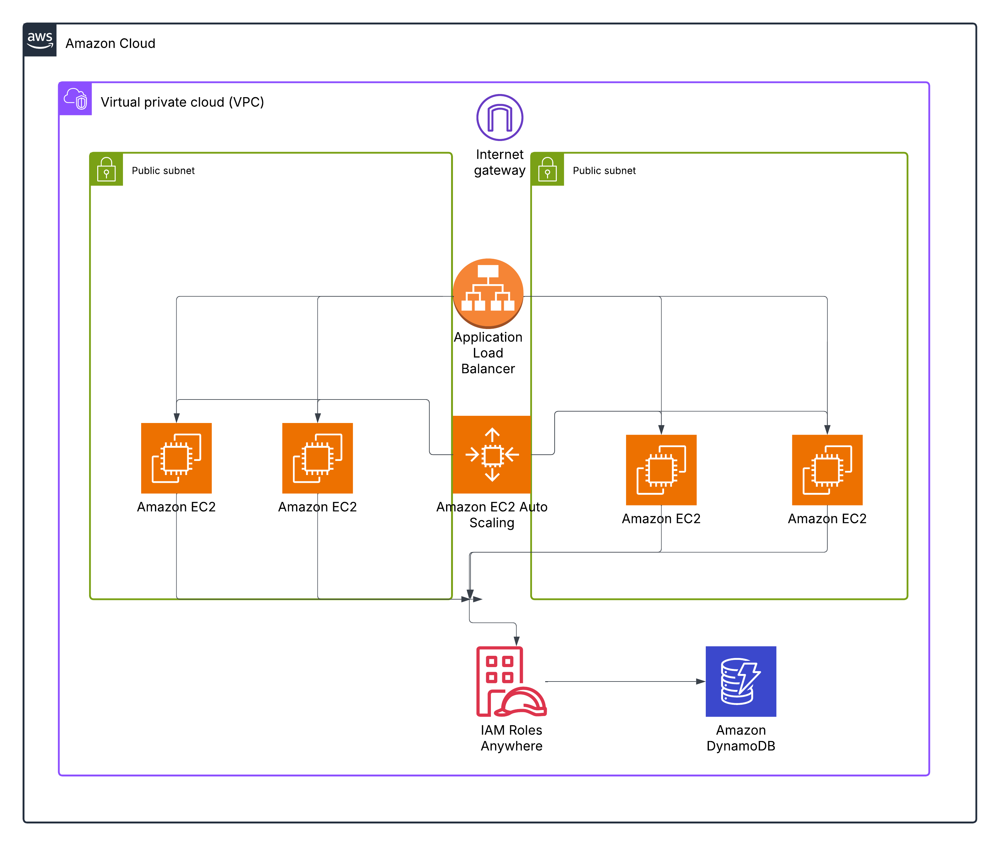

# Infrastructure AWS avec Terraform : Application Web Évolutive

<div align="center">
  
</div>

## Aperçu de l'infrastructure

- **VPC** : Réseau virtuel avec deux subnets publics pour la haute disponibilité.
- **Application Load Balancer (ALB)** : Distribue le trafic vers les instances EC2.
- **Auto Scaling Group (ASG)** : Gère entre 2 et 4 instances EC2, avec une politique de scaling basée sur l'utilisation CPU (cible : 50%).
- **EC2 Instances** : Serveurs web sous Amazon Linux 2 avec Nginx installé, accessibles via SSH avec une clé personnalisée.
- **DynamoDB** : Table simple pour stocker des données backend.
- **Security Groups** : Contrôlent le trafic HTTP (port 80) depuis l’ALB et SSH (port 22) depuis une IP spécifiée.
- **IAM Role** : Permet aux instances EC2 d'interagir avec DynamoDB.

## Installation et Déploiement

1. **Cloner le dépôt** :
   ```bash
   git clone https://github.com/<ton-utilisateur>/<nom-du-repo>.git
   cd <nom-du-repo>
2. **Initialiser Terraform** :
    ```bash
    terraform init

3. **Appliquer Terraform** :
     ```bash
    terraform apply
